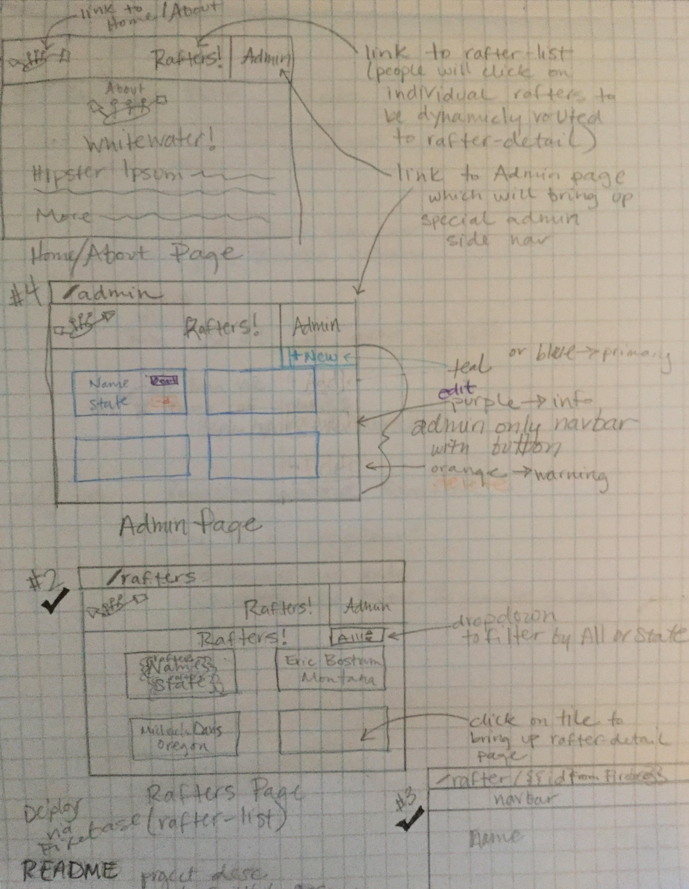

# _Sunny Days Whitewater_
#### [Click for live site](https://whitewater-8efd7.firebaseapp.com/rafters) <br>
This application allows members of Sunny Days Whitewater to connect with each other. Members can be added, edited, and deleted from an Admin page.
#### By _**Michaela Davis**_   &nbsp; 4.07.17

## Description
This application allows members of Sunny Days Whitewater to connect with each other. All members can be viewed on the "RAFTERS" page, and users can click on a rafter to be dynamically routed to a detail page containing more information about that rafter. The user can also choose to view rafters from "All States", "Montana", or "Oregon". Members can be added, edited, and deleted from an Admin page.


## Prerequisites

You will need the following things properly installed on your computer:

* [Angular CLI](https://github.com/angular/angular-cli) v1
* [Atom](https://atom.io/) v1 (or another text editor)
* [Bower](https://bower.io/) v1
* [Git](https://git-scm.com/) v2
* [Node.js](https://nodejs.org/) v4 (with NPM)
* [TypeScript](https://git-scm.com/) v2

## Installation

```bash
git clone https://github.com/Michaela-Davis/javascript_angular_whitewater.git
cd javascript_angular_whitewater
npm install
bower install
npm install angularfire2 firebase
```


## Connect Firebase account
* Create `src/app/api-keys.ts` in `javascript_angular_whitewater`
  * paste the following inside:
    ```typescript
    export var masterFirebaseConfig = {
          apiKey: "xxxx",
          authDomain: "xxxx.firebaseapp.com",
          databaseURL: "https://xxxx.firebaseio.com",
          storageBucket: "xxxx.appspot.com",
          messagingSenderId: "xxxx" };
    ```

* Create a free [Firebase](https://firebase.google.com/) Account
* Create a remote database for the application through Firebase's website:
  * Go to the user dashboard area. Choose the option "Create a New Project".
  * Name your database `rafters`
  * You'll then be taken to an "Overview" area. Select "Add Firebase to your web app".
  * Firebase should respond with a pop-up modal window. Copy your Firebase information for `apiKey`, `authDomain`, `databaseURL`, `storageBucket`, and `messagingSenderId` into the `src/app/api-keys.ts` file created in `javascript_angular_whitewater`. Save.
* Return to the Firebase Console, and select your project's name from the list.
* Visit the Database area by selecting the Database option from the navbar on the left-hand side. Near the top of the page, there should be a blue navbar reading Realtime Database. Below this, select the option that reads RULES.
  * Change both the `".read"`, and `".write"` properties here to `"true"`, like this:
    ```json
    {
      "rules": {
        ".read": "true",
        ".write": "true"
        }
    }
    ```

## Running / Development

* `ng serve`
* Visit your app at [http://localhost:4200](http://localhost:4200).


This project was generated with [angular-cli](https://github.com/angular/angular-cli) version 1.0.0-beta.28.3.

## Further help

To get more help on the `angular-cli` use `ng help` or go check out the [Angular-CLI README](https://github.com/angular/angular-cli/blob/master/README.md).

### License

*MIT license*

## Planning for Sunny Days Whitewater
<div style="text-align:center"></div>

<br>
Copyright (c) 2017 Michaela Davis All Rights Reserved.
